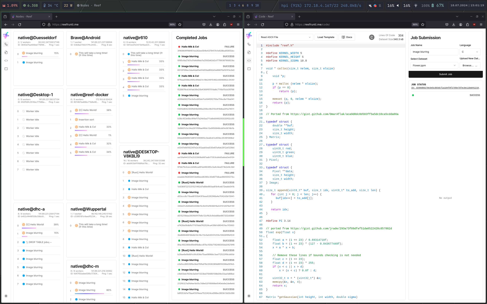
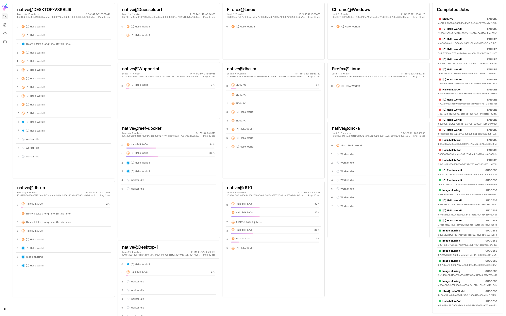
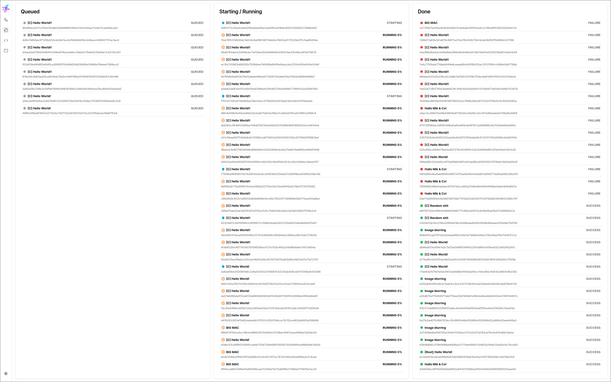
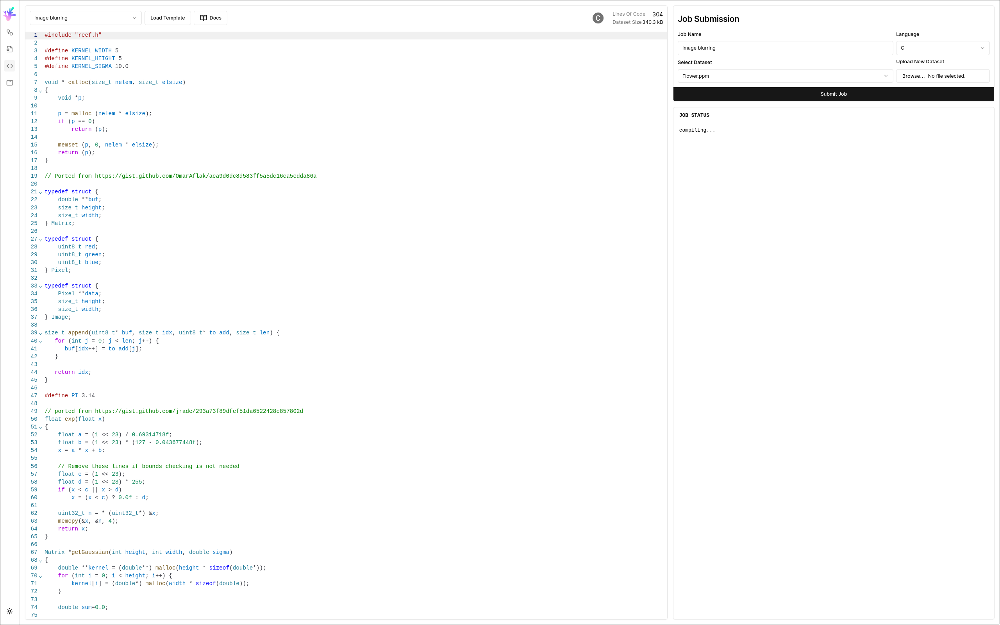

# Reef Webassembly Runtime

## Screenshots

Dashboard on the left, code editor on the right.

Dashboard

Jobs overview

Code Editor: C

## Overview and Motivation

Reef is a fault-tolerant, distributed Webassembly runtime.
The key idea is that users can submit jobs which are executed by reef.
Reef provides a layer of abstraction in the sense that the user does not have to care *where* their code runs.

### Nodes and Workers

TODO: here
